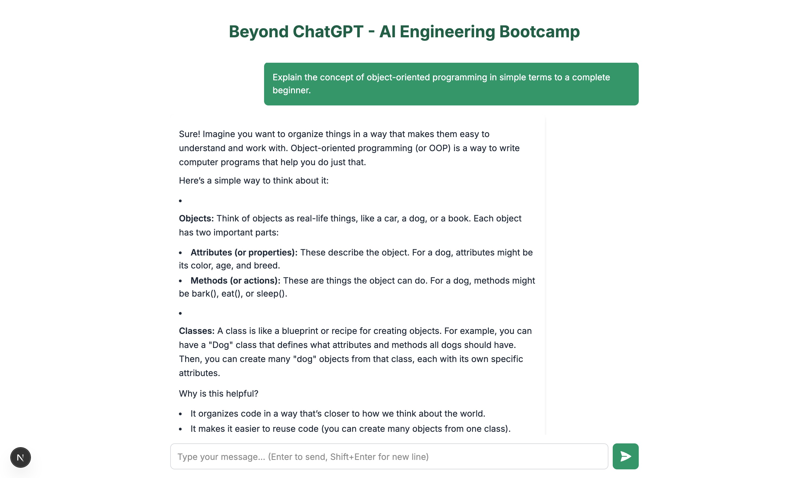
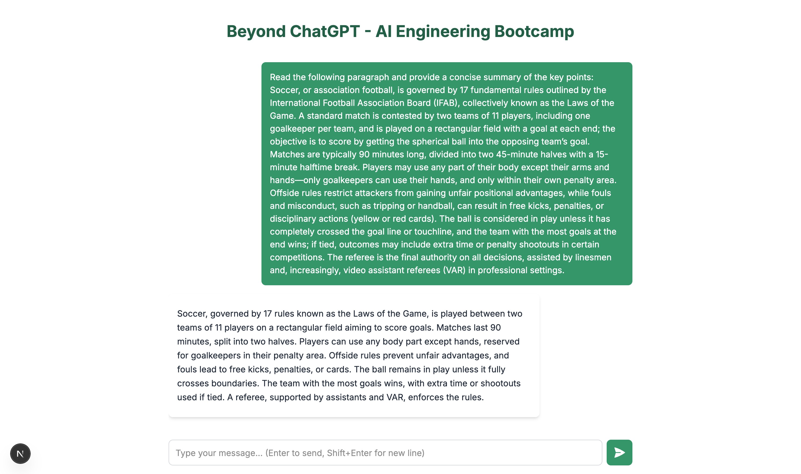
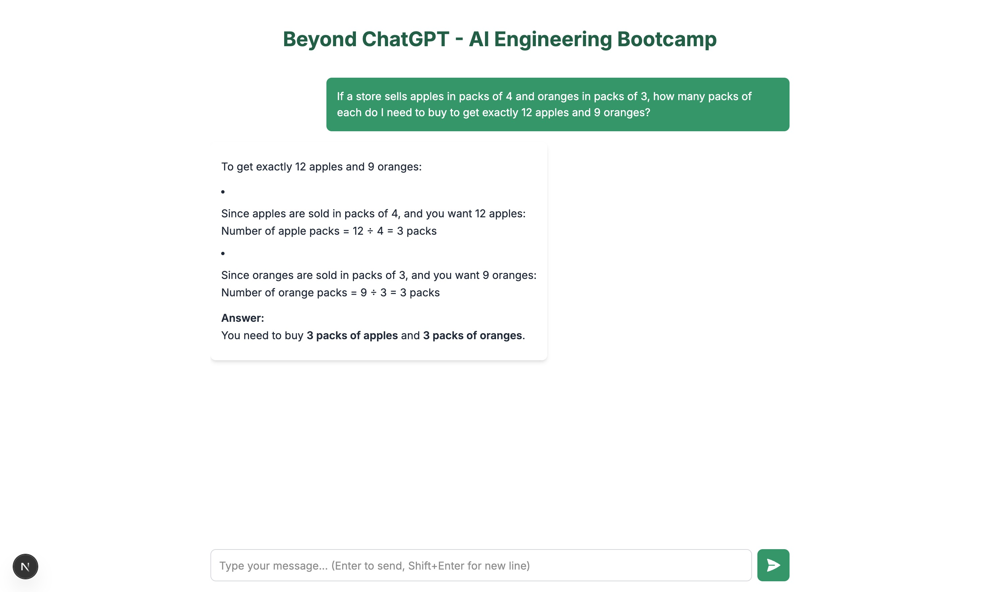

# Please evaluate your system on the following questions:

## Explain the concept of object-oriented programming in simple terms to a complete beginner.

With this prompt, I validated the accuracy of the response, and made adjustments to the UI to render markdown content, as well as providing a loading indicator.

## Read the following paragraph and provide a concise summary of the key points…

In this case, I validated the summarization capabilities of the bot. It also helped me to tweak the UI further, as the text box for entering messages now grows as the user enters more and more content, and it also has a keyboard shortcut to enter new lines.

## Write a short, imaginative story (100–150 words) about a robot finding friendship in an unexpected place.

In this case, I validated the creative capabilities of the model.

## If a store sells apples in packs of 4 and oranges in packs of 3, how many packs of each do I need to buy to get exactly 12 apples and 9 oranges?

In this case, I validated the accuracy doing basic calculations of the model.

## Rewrite the following paragraph in a professional, formal tone…

Finally, I validated the capability of the model to adapt to new tones and instructions.