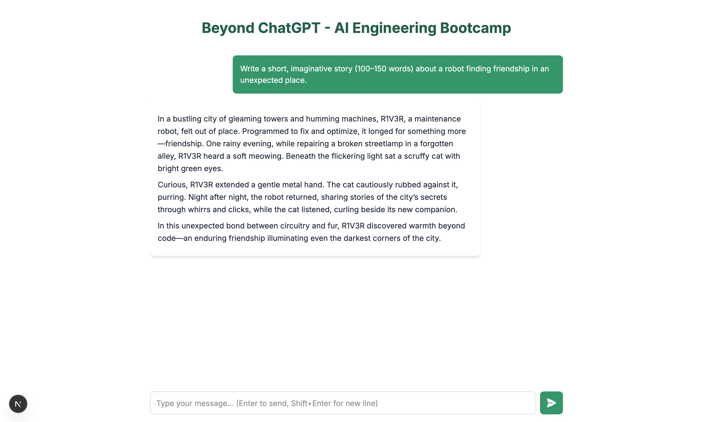

# Please evaluate your system on the following questions:

## Explain the concept of object-oriented programming in simple terms to a complete beginner.


With this prompt, I validated the accuracy of the response, and made adjustments to the UI to render markdown content, as well as providing a loading indicator.

## Read the following paragraph and provide a concise summary of the key points…

```
Soccer, or association football, is governed by 17 fundamental rules outlined by the International Football Association Board (IFAB), collectively known as the Laws of the Game. A standard match is contested by two teams of 11 players, including one goalkeeper per team, and is played on a rectangular field with a goal at each end; the objective is to score by getting the spherical ball into the opposing team’s goal. Matches are typically 90 minutes long, divided into two 45-minute halves with a 15-minute halftime break. Players may use any part of their body except their arms and hands—only goalkeepers can use their hands, and only within their own penalty area. Offside rules restrict attackers from gaining unfair positional advantages, while fouls and misconduct, such as tripping or handball, can result in free kicks, penalties, or disciplinary actions (yellow or red cards). The ball is considered in play unless it has completely crossed the goal line or touchline, and the team with the most goals at the end wins; if tied, outcomes may include extra time or penalty shootouts in certain competitions. The referee is the final authority on all decisions, assisted by linesmen and, increasingly, video assistant referees (VAR) in professional settings.
```


In this case, I validated the summarization capabilities of the bot. It also helped me to tweak the UI further, as the text box for entering messages now grows as the user enters more and more content, and it also has a keyboard shortcut to enter new lines.

## Write a short, imaginative story (100–150 words) about a robot finding friendship in an unexpected place.



In this case, I validated the creative capabilities of the model.

## If a store sells apples in packs of 4 and oranges in packs of 3, how many packs of each do I need to buy to get exactly 12 apples and 9 oranges?


In this case, I validated the accuracy doing basic calculations of the model.

## Rewrite the following paragraph in a professional, formal tone…

```
Soccer (or “football” if you’re outside the U.S. and enjoy arguments) is a wildly popular game where two squads of 11 humans run around for 90 minutes trying to kick a ball into a net while pretending not to be tired. The only person allowed to use their hands is the goalie, who guards the goal like a caffeinated octopus in a hoodie. Everyone else just flails their legs wildly in hopes of becoming a YouTube highlight. If you score more goals than the other team, you win. If it’s a tie, everyone just shrugs, unless it’s a tournament, in which case things get dramatic with extra time and possibly a penalty shootout — basically a nerve-wracking kicking contest. There’s a pesky thing called the offside rule, which nobody fully understands (not even the referees), but it’s there to ruin perfectly good goals. If you’re naughty — like tripping someone, pretending you’ve been hit by a truck, or giving someone a spontaneous hug — the ref might give you a yellow card (a warning), or a red card (a dramatic exit). The ref is the boss, assisted by a few people with flags and, in recent times, a team of video nerds who replay everything in slow motion to spot crimes against football justice. In short: kick the ball, don’t be a jerk, and try not to cry in front of millions.
```


Finally, I validated the capability of the model to adapt to new tones and instructions.